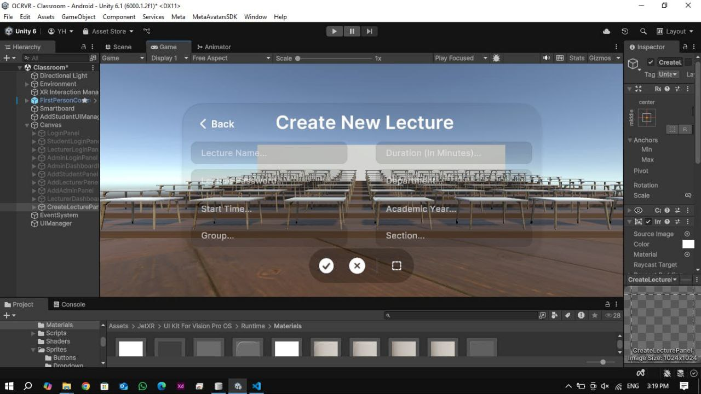
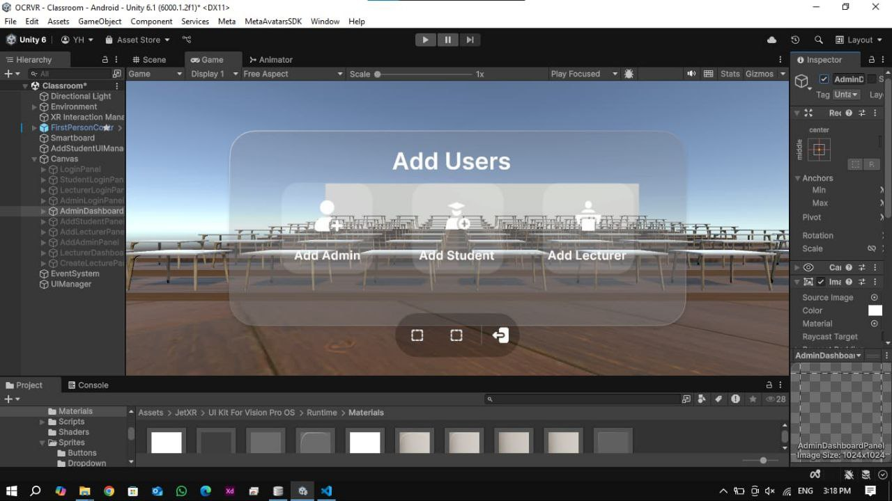
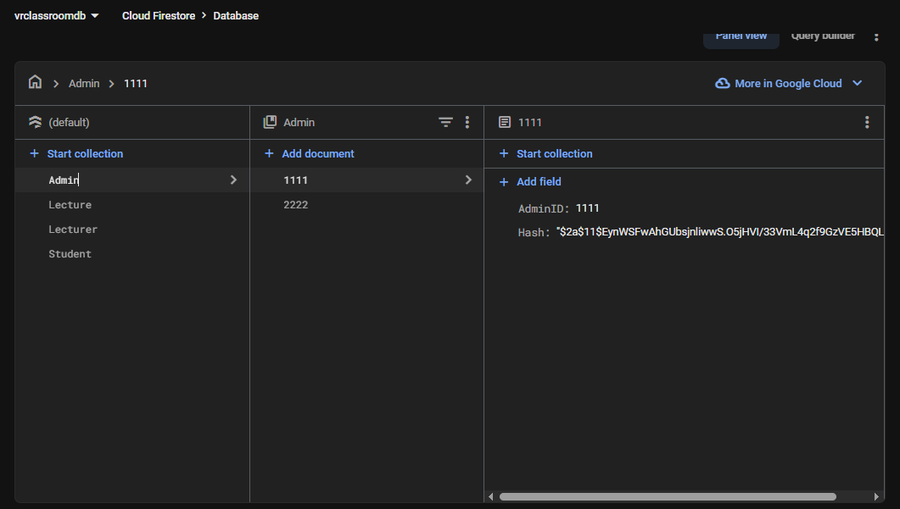
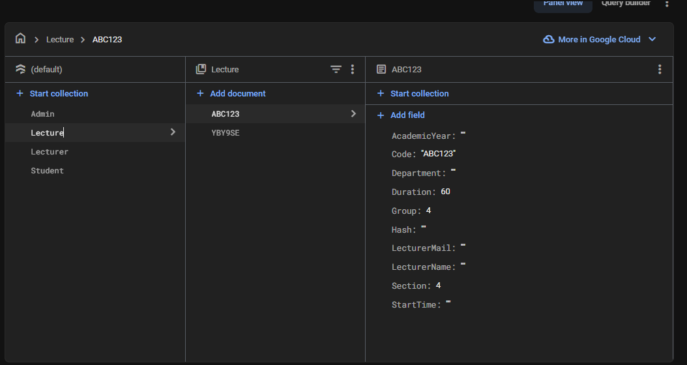
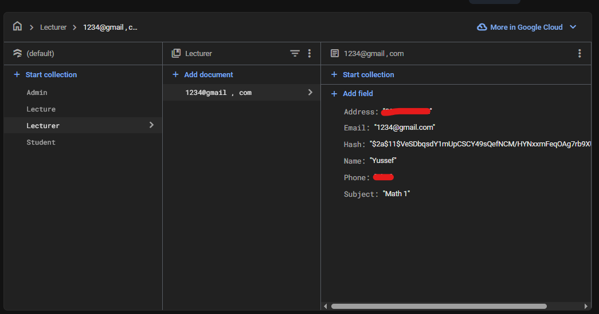
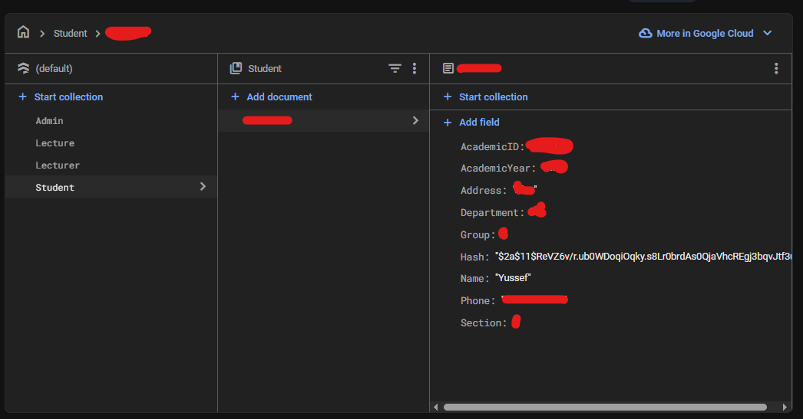

# VR Classroom — Graduation Project

## Overview
In my graduation project, I started a new challenge that pushed me to learn something I had never thought of learning before game development and the use of the Unity Engine despite having over six years of experience in programming.

At my university, students are required to create a graduation project every year. The idea for this project was proposed by Eng. Ahmed Sultan, who suggested developing a new concept that makes learning easier and more advanced in light of modern technological developments.

---

## Project Idea
The idea originated from a real problem the university is located far away, and many students live away from home.  
That’s where the concept was born: to create a simulation of education using Virtual Reality (VR).

Our goal was to build a complete educational environment through VR.

---

## Key Features
- Immersive Virtual Reality learning experience
- Integrated Learning Management System (LMS)
- Secure student login system
- Personalized dashboard showing:
  - Lectures
  - Sections
  - University materials  
  based on:
  - Department  
  - Academic year  
  - Group  
- Multi-lecture environment: multiple lectures can run in the same virtual classroom simultaneously
- Lecturer panel to:
  - Create and manage lectures
  - Assign them by department, subject, and academic year

---

## Technologies Used
- Unity Engine
- C# (Scripting)
- Firebase For Database Integration
- VR (Meta Quest 3s / Meta XR Toolkit)
- Photon Fusion (for networking)

---

## 📸 Project Screenshots
Below are some internal screenshots from the project to illustrate the concept:

  

---

## Database Structre

  
  
  
  

---

## Developers
Yusef Ahmed Helmy  
Full Stack Developer & Cybersecurity Penetration Tester  

  

Ephraim Emad  
AI Eng & Full Stack Developer  

  

---

## University

